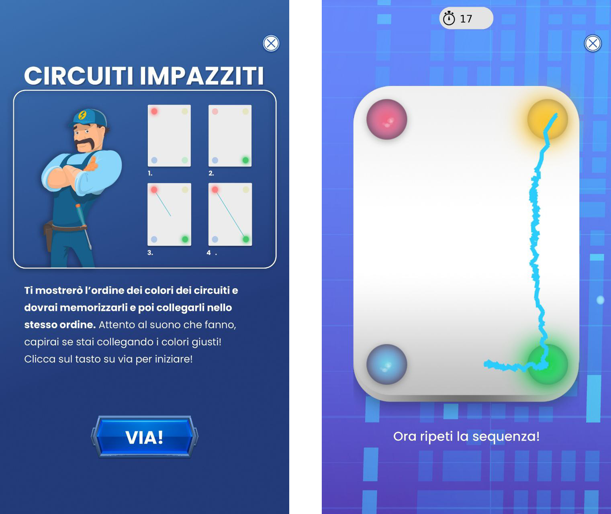

## Project insights

<!--logo-->

Allenamente is a children videogame developed for <b>Policlinico di Roma</b>. Its distinctive feature is its clinical use: the videogame it’s meant to be played by children affected by brain cancer and to <b>collect and track useful data about young patient status</b>.

The game features different mini-games and puzzles intended to provide help to a fictional scientists team that is attempting to evolve some cute little creatures. When the player wins the game, <b>he’s rewarded with some points that will be used to evolve the creatures, that will mutate in different shapes</b>.

<!--intro-->

<b>The games are designed to be meaningful and useful to collect certain informations about childrens’ cognitive functions</b> such as sight capability, language, images and context understanding, memory and more. Medical staff got access to updated personal and peculiar medical records of every player.

Medical staff has also the control over different features of the games (from overall difficulty to more peculiar variables) in order to adjust the play experience for every patient.

<!--companion-->

## Minigames
<b>Puzzle</b>

<b>Quiz</b>

<b>Crazy circuits</b>: a simon says with the goal to connect elements in sequence

