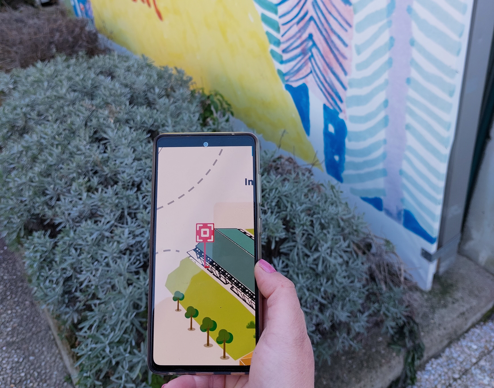
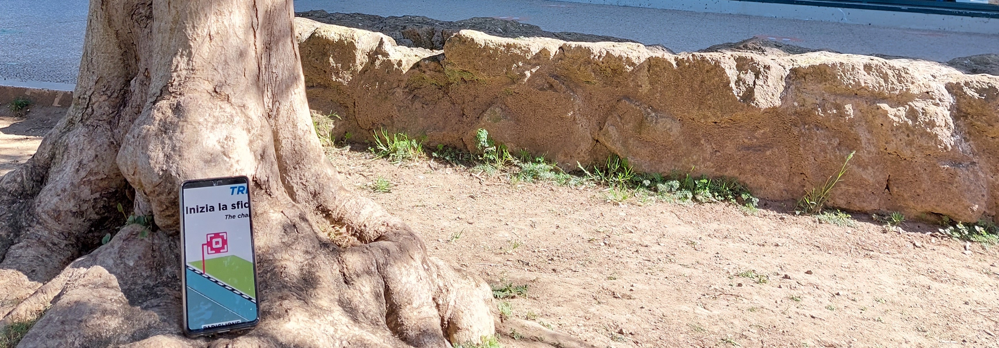

## Project insights

"Caccia al tesoro" is a scavenger hunt to be played in through any device that involves an augmente reality quiz inside the gardens of Explora.
<b>The players find QR codes in the site that opens different challenges</b> with the aim of finding a secret ingredient for the experiment conducted by the two digial guides of the player: Stefania and Emanuele. Every correct answer will give an hint about where to find the precious ingredient.

The activity allows to <b>approach playfully the STEM methodology</b> and to know fun facts about sciene, technology and engineering combining physical and digital gaming.

Archive photos and video: Explora

