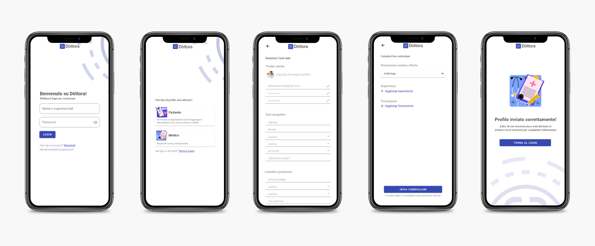
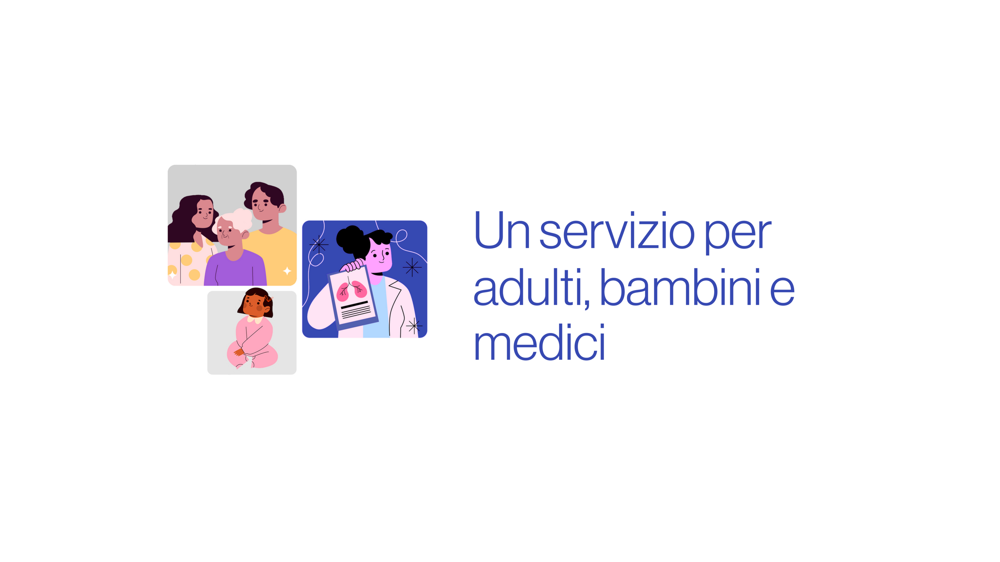

## Project insights

We have been asked to develop the prototype a gestional app just starting from an idea: <b>to make it quick and easy to get domiciliar medical care</b>.
Dottora provides both an intuitive way of selecting the needed healt professional and a useful gestional tool for the doctors themselves.

## Project development

We started by <b>designing a clean and functional visual identity</b>, lightened by playful illustration.

After this first step, discussing with our client we developed an information architecture balanced between the required user-friendliness and the practical needs (such as official medical forms to be filled).
<b>We prototyped a first version of the app, useful for user testing and idea pitch</b>.

Finally we defined a <b>blueprint strategy</b> for the further development of the project: alongside the prototype and the website, we provided a pitch presentation and a Next step document.

