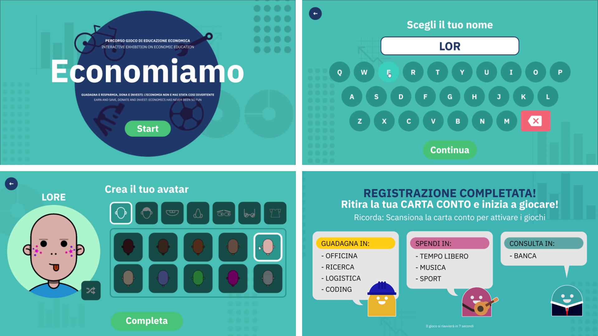
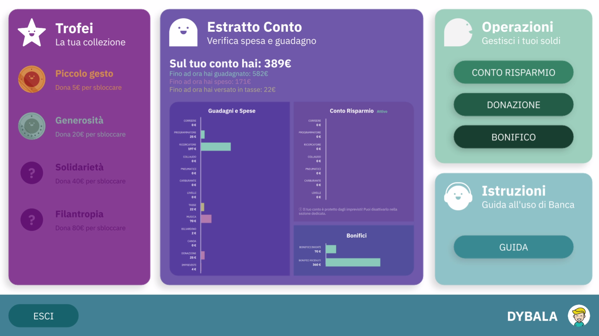
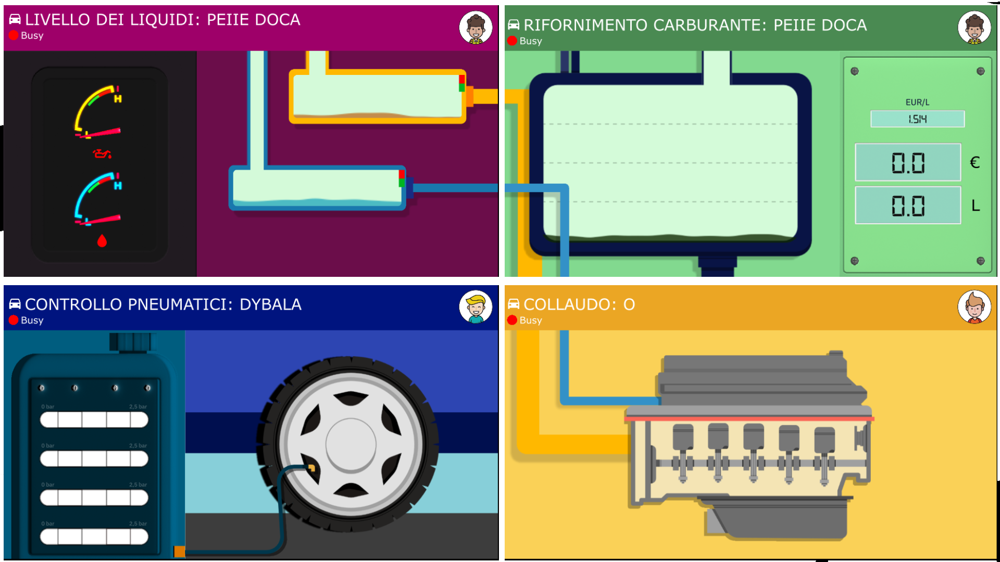
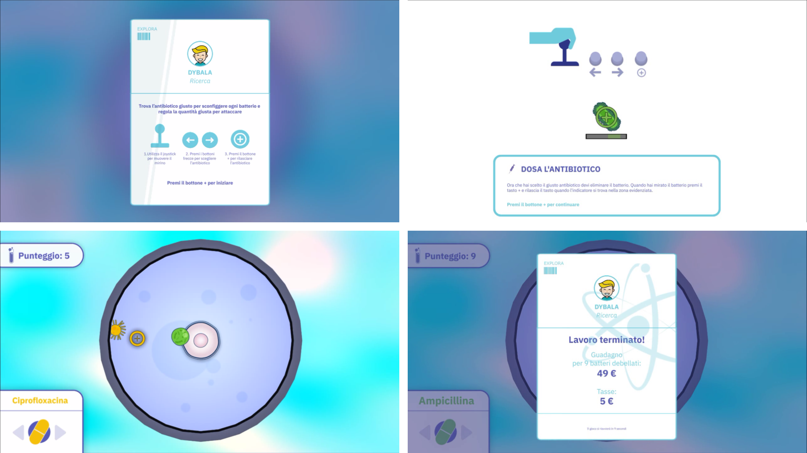
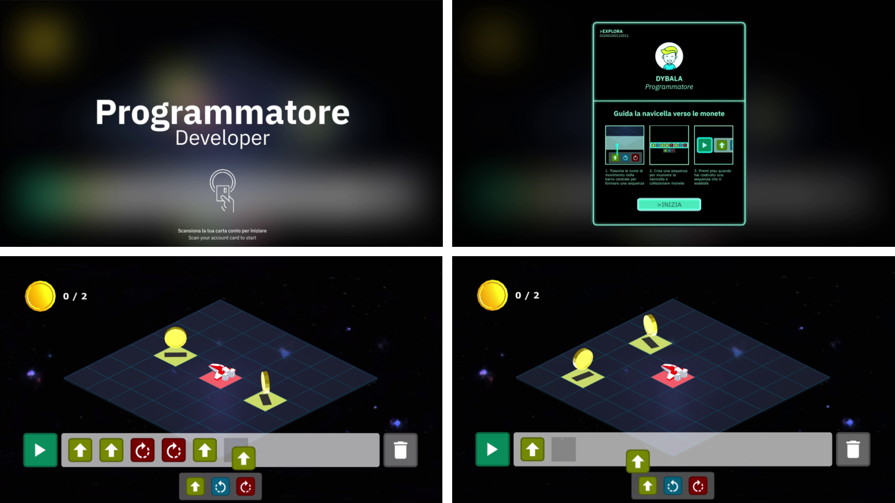
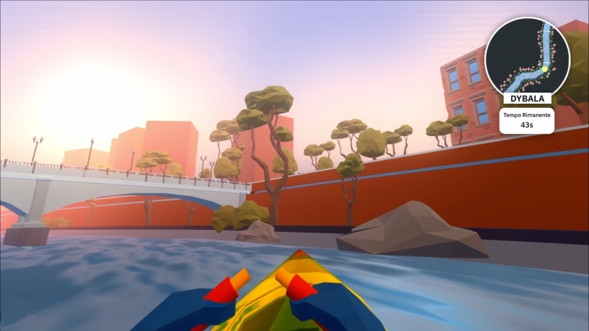
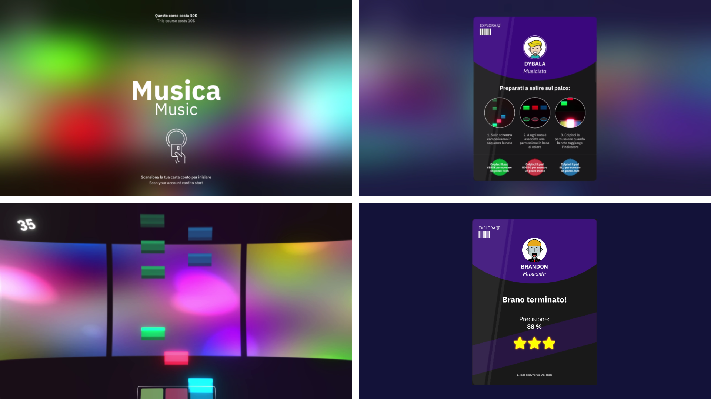

Economiamo, let’s save: earn and save, donate and invest, economy has never been that fun!” is a new exhibition on economic education.

The exhibition – for children aged from 6 to 11 years – includes 10 interactive stations:

**Sign up**, to choose your own avatar and create your Account Card;  

**Bank**, to become familiar with a sensible and conscious use of money.

Four stations to learn working activities in fields such as **mechanics**, **microbiology**, **logistics** and **coding**: 

**Auto Repair Shop**, a station equipped with a car to help children understand how a “clean” energy such as in a hybrid system works: Test Driver, where children can make a driving test to use both engines – electric and thermal – as well as the kinetic energy from the moving wheels that would go wasted otherwise; Checking Tyre Pressure, to inflate tyres properly to ensure safety; Getting Fuel and Checking Fluid Levels, to check fuel, engine oil, and coolant fluid.

**Research** allows children to take a virtual journey into the microbiology world, and helps them tell the difference between good and bad bacteria and learn, through play, important concepts about the use of antibiotics. It’s a challenge the microbiologist-child will be facing to defeat a bacterium.

**Coding** is focused on new digital technologies. Children can turn into junior or expert programmers and create an animation out of an exact sequence of code blocks, and learn about the logic behind programming.

Three more buying and earnings stations:

**Sport**, the station to train body and mind through rowing;

**Music**, where children can learn how to play their first notes;

