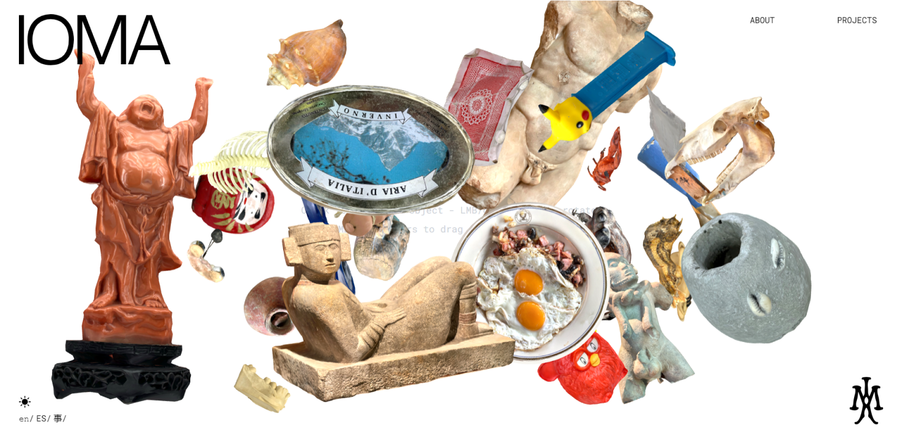

IOMA stands for Institute of Mundane Archeology. IOMA aims to explore objects outside their historical time {anachronistic} but also familiar ones that do not stand out for their originality {mundane}, transforming ideas from the personal to the public, from a micro to a macro perspective.

The main features of the website is allowing the user to generate and transform multiples 3d models. These may be random or as part of peculiar collections. They could be used as a brush to paint and decorate or as elements to build new sculptures. Models generation is possible not only in the landing blank canvas, but also in the projects page, allowing users to embellish and customize the page.

Hosted at: [https://ioma.institute](https://ioma.institute)
