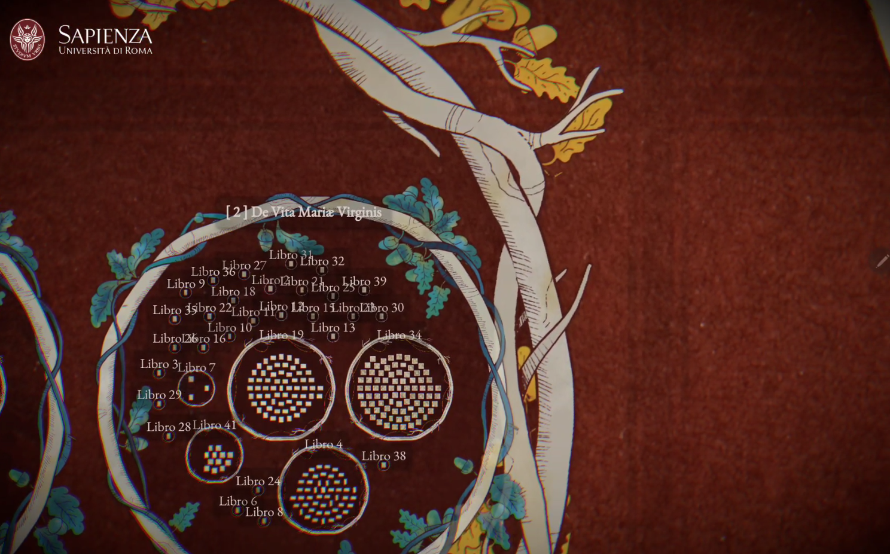
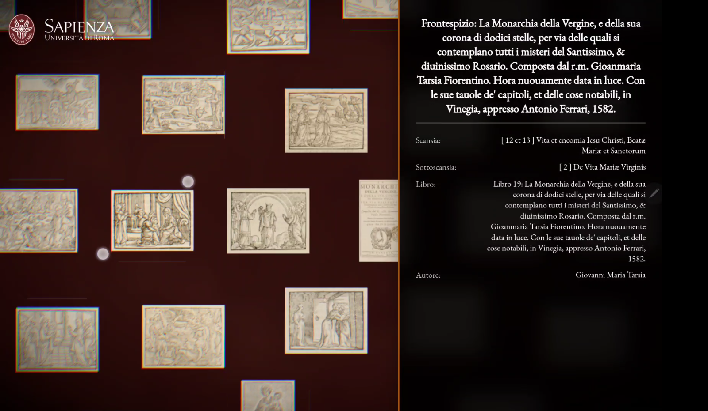
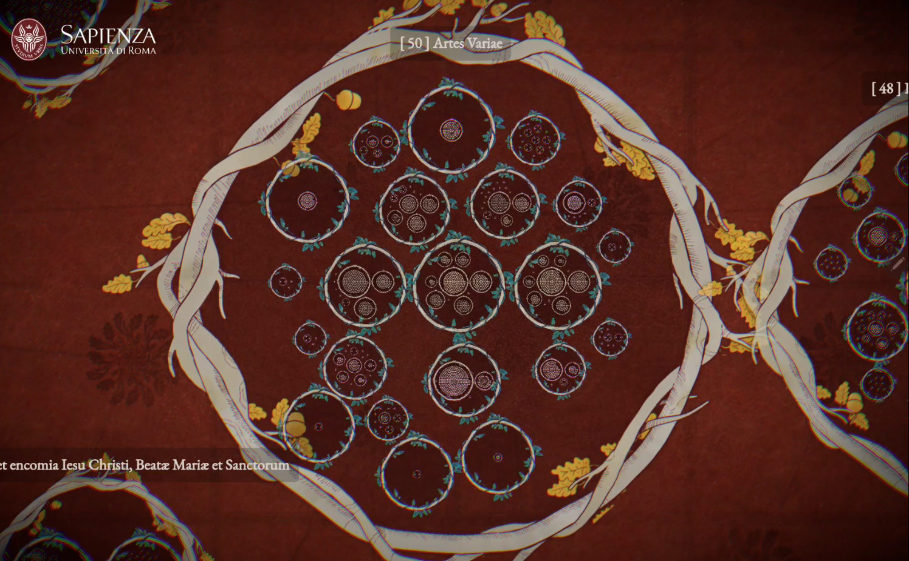

The research project Immaginare i Saperi, conceived in 2018 by Massimo Moretti, involves the systematic examination of the iconographic heritage preserved in the books that belonged to Francesco Maria II della Rovere. The project identifies, catalogs, and connects the book images with the Rovere collections and the life of the sixth duke. The studies on the images, begun in 2018, have followed a precise method of "circular research," whose aim is to start from a single engraving to analyze its context of origin, dissemination, fortune or derivation, and its relationship with artistic and artisanal production, following a centrifugal movement from the book, to the library, to the duchy, and so on. Each cataloged image is entered into the database, whose purpose is to disseminate the iconographic heritage of the ducal library, clarify its contents and relationships, and provide technical data. 

The project involves thesis students, PhD candidates, interns, research fellows, and scholars who bring diverse expertise to increase knowledge about the imagination of Francesco Maria II. Cataloging the images, in fact, requires a broader study of the volumes on the shelves, sometimes demanding a multidisciplinary approach that matches the nature of the book collection and facilitates the reconstruction of the iconographic kaleidoscope of the library. The database was created as a natural tool for consulting the material in an agile and continuously updatable way, and with its functions, it makes research fruitful and effective.

