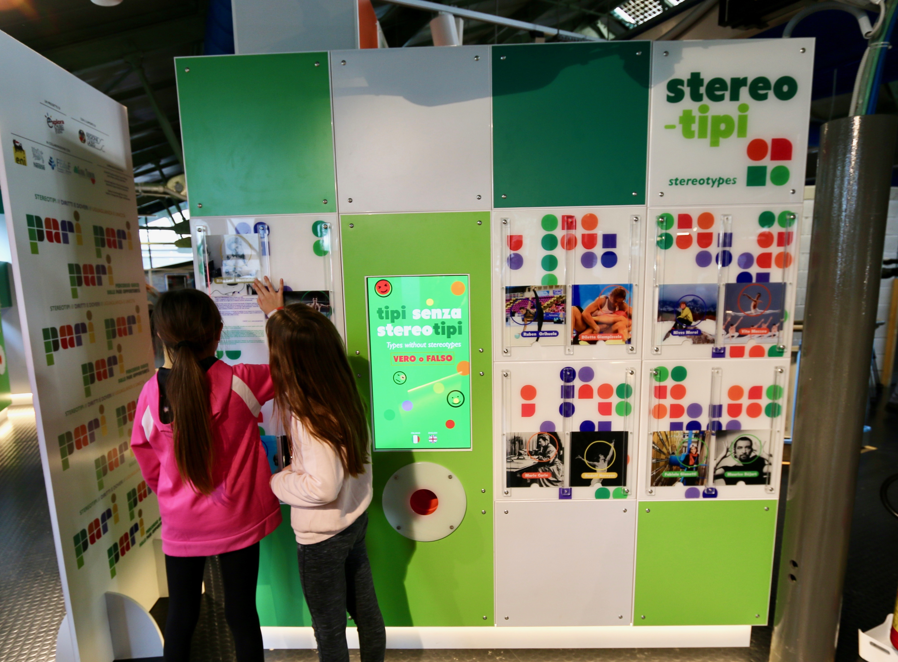
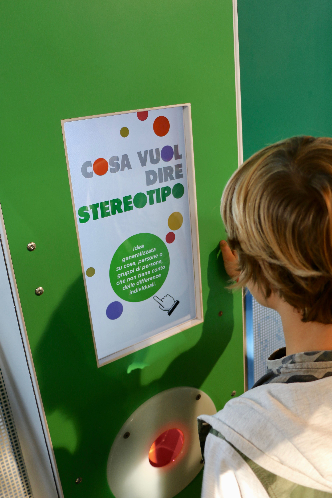

## Project insights

Pari offers children, families and schools the opportunity to think about and learn more about rights and duties, equality and uniqueness, and overcome gender stereotypes. The new play-based path <b>includes 11 interactive stations and educational activities focusing on “learning by doing” approach</b>, dealing with three broad themes: stereotypes, rights and duties, equality and uniqueness.

## Why "Pari"?

In today’s society, new generations are always faced with new challenges; therefore, it’s more and more important to understand and tell between gender stereotypes and real differences, opportunities and uniqueness, and raise awareness on “gender equality”.
The 2018 edition of Global Gender Gap Report by the World Economic Forum suggests that it will take 108 years to close the global gender gap.

Raising awareness on Equal Opportunities means to bring future generations towards an inclusive society, that won’t thwart any chance of growth, choice and decision-making.

The play-based path was made with the support of Regione Lazio, in collaboration with ENI S.p.A, Nestlé Italiana S.p.A., FEDUF Fondazione per l’Educazione Finanziaria e il Risparmio, Global Thinking Foundation and scientifically supervised by the Catholic University, the Sapienza University and the Unitelma Sapienza University.

Archive photos: Explora

